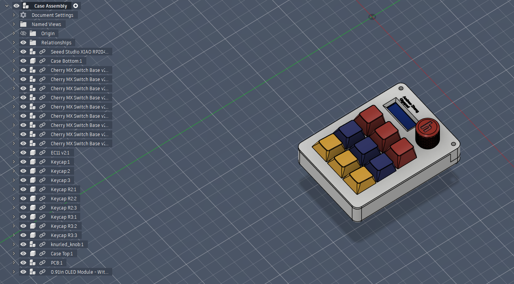

# Gigapad
A 9-key macropad that includes a LED for each key, a rotary encoder and a 0.91-inch OLED display. 

Features: Gigapad – 9-Key Macropad with Rotary Encoder & OLED

Gigapad is a custom **9-key mechanical macropad** built around the **Seeed XIAO RP2040**, featuring a **rotary encoder** (not part of the key matrix) and an **OLED display**.  
It is designed as a compact, programmable input device using **QMK firmware**, suitable for shortcuts, media control, and custom workflows.

---

## 📸 Overall Hackpad

This image shows the completed Gigapad, including the key layout, rotary encoder placement, and overall form factor.

---

## 📐 Schematic

The schematic shows:
- A **3×3 key matrix** (9 keys total)
- A **rotary encoder connected directly to GPIO pins** (not part of the matrix)
- An **OLED display over I²C**
- Power and data routing for the microcontroller and peripherals

---

## 🧩 PCB

The PCB is a **2-layer board** designed for JLCPCB manufacturing with:
- 1 oz copper
- Dedicated encoder pins
- Proper ground pours
- Clearances suitable for hand soldering

---

## 🧱 Case & Assembly Fit

The case is designed to:
- Secure the PCB using **heat-set brass inserts**
- Support the rotary encoder and key switches
- Allow easy access to the USB-C port
- Be 3D-printed and assembled with standard M3 hardware

---

## 🧾 Bill of Materials (BOM)

| Part | Quantity | Description |
|----|----|----|
| Microcontroller | 1 | Seeed XIAO RP2040 |
| Mechanical Switches | 9 | MX-style switches |
| Keycaps | 9 | MX compatible |
| Rotary Encoder | 1 | EC11 or compatible |
| OLED Display | 1 | SSD1306 I²C OLED |
| Diodes | 9 | 1N4148 or equivalent |
| Resistors | 1 | Encoder pull-ups (if required) |
| Brass Heat-Set Inserts | 4 | M3 |
| Screws | 4 | M3 × 16 mm |
| PCB | 1 | Custom 2-layer PCB |
| Case | 1 | 3D-printed enclosure |

---

## 💻 Firmware

Gigapad runs **QMK firmware**, configured for:
- 3×3 key matrix
- Rotary encoder using dedicated GPIO pins
- OLED display output
- Fully customizable keymap

Firmware Overview:

