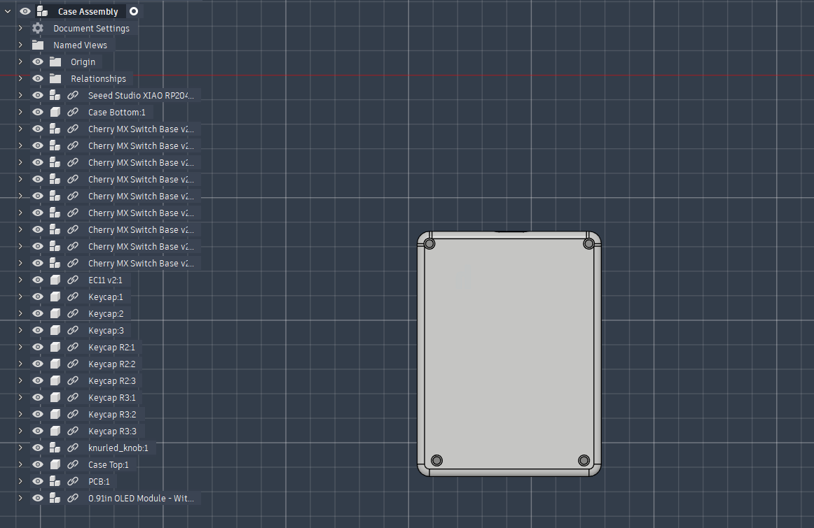
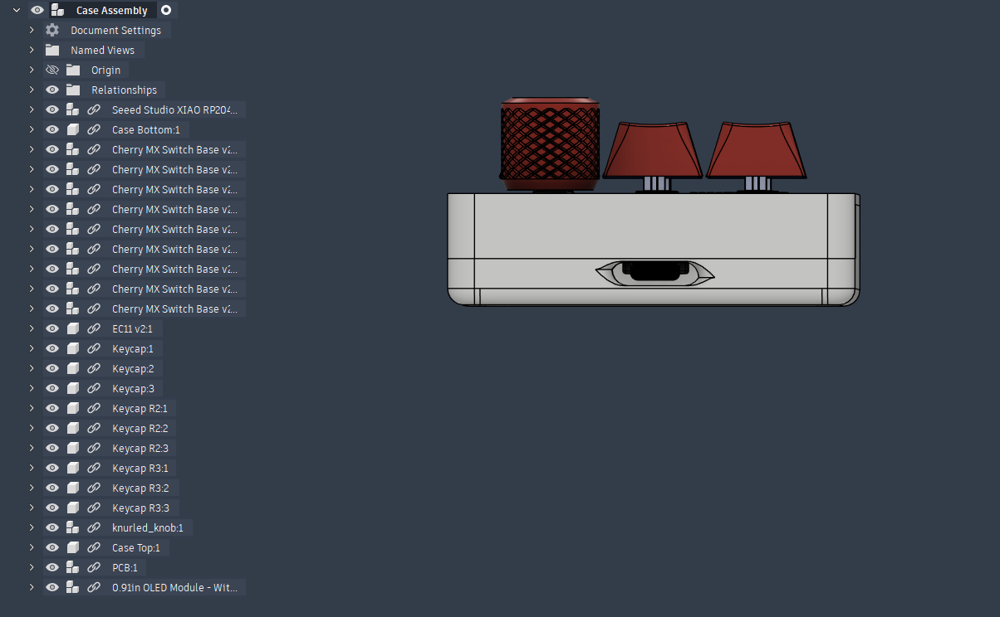
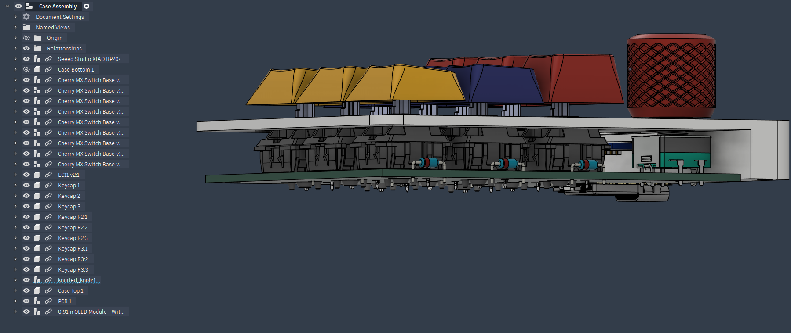
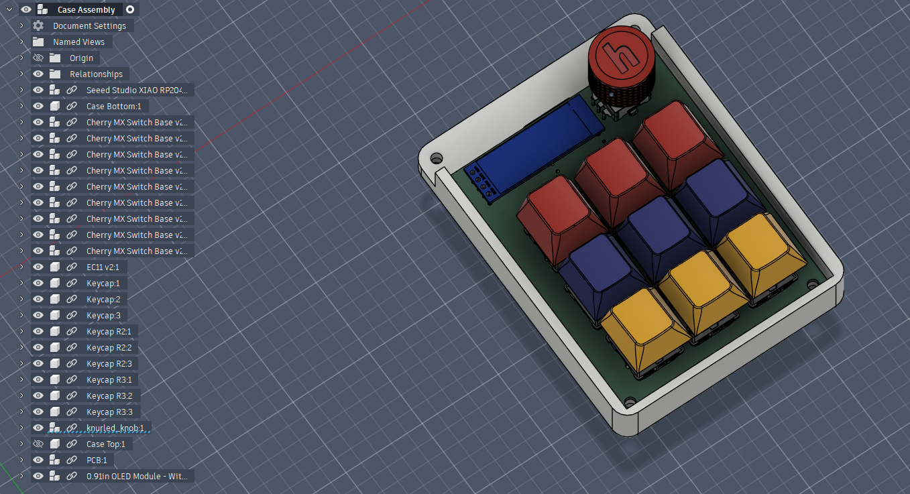

# Gigapad
A 9-key macropad that includes a LED for each key, a rotary encoder and a 0.91-inch OLED display. 

Features: Gigapad – 9-Key Macropad with Rotary Encoder & OLED

Gigapad is a custom 9-key mechanical macropad built around the Seeed XIAO RP2040, featuring a rotary encoder (not part of the key matrix) and an OLED display.  
It is designed as a compact, programmable input device using QMK firmware, suitable for shortcuts, media control, and custom workflows.

---

## 🧱 Case & Assembly Fit

Made using Fusion 360 

Features:
- Easy access to the USB-C port
- Secured PCB and case using 4 M3 Screws with brass heatsets (2 on the case, 2 on the case and pcb)
- Different key levels for a more ergonomic feel

  
---

## 📐 Schematic

Made Using KiCad

The schematic shows:
- A 3×3 key matrix 
- A rotary encoder connected directly to GPIO pins 
- An OLED display
- 9 Mini-LED in series delivered using parallel power

---

## 🧩 PCB

The PCB is a 2-layer board designed for JLCPCB manufacturing with:
- 1 oz copper
- Dedicated encoder pins
- Ground pours and 5V pour

---

## 🧾 Bill of Materials (BOM)

| Part | Quantity | Description |
|----|----|----|
| Microcontroller | 1x | Seeed XIAO RP2040 |
| Mechanical Switches | 9x | MX-style switches |
| Keycaps | 9x | ABS Keycaps |
| Rotary Encoder | 1x | EC11 |
| OLED Display | 1x | 0.91-inch OLED Display |
| Diodes | 9x | 1N4148  |
| Brass Heat-Set Inserts | 4x | M3 |
| Screws | 4x | M3 × 16 mm |
| PCB | 1x | Custom 2-layer PCB |
| Case | 1x | 3D-printed enclosure |

---

## 💻 Firmware

Gigapad runs **QMK firmware**, configured for:
- 3×3 key matrix
- Rotary encoder using dedicated GPIO pins
- OLED display output
- Fully customizable keymap

